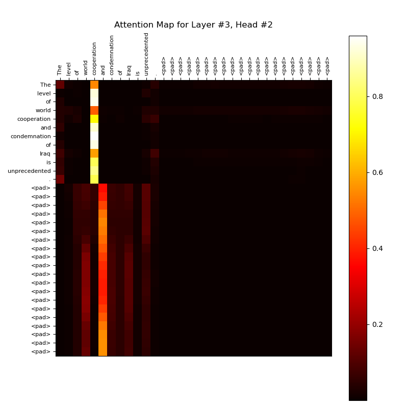
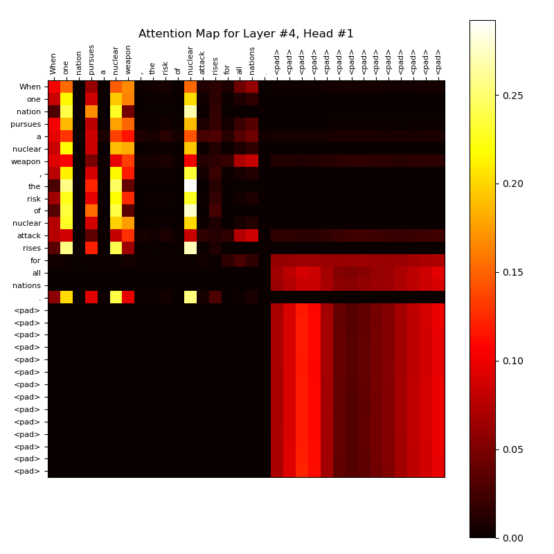
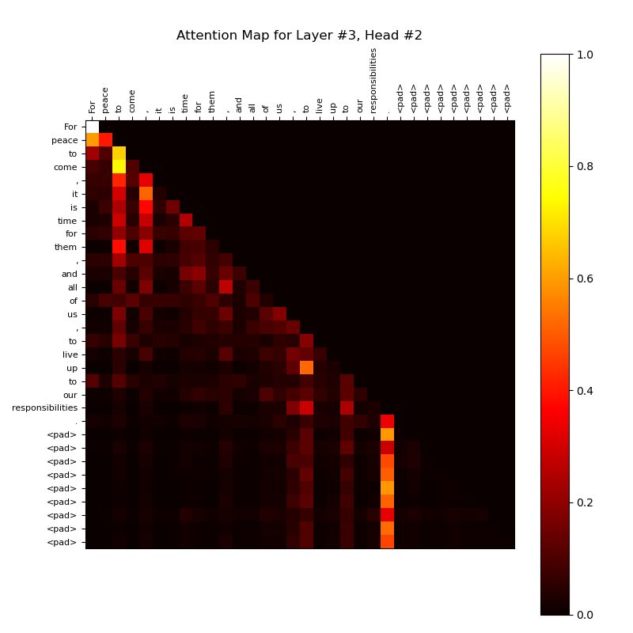
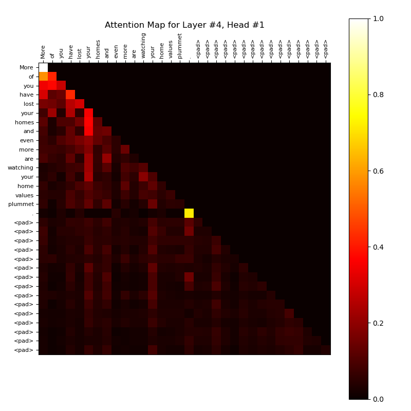

# Transformer Encoder for Speech Classification

This project implements a **Transformer Encoder** with multi-head self-attention for speech segment classification. Additionally, it includes a **Transformer Decoder (GPT)** with masked self-attention to generate speech segments and evaluate the model's perplexity.

## Project Overview

The project explores the application of Transformer-based architectures for speech classification and generation tasks. It focuses on:

1. **Speech Classification**:
   - Using a Transformer Encoder to classify speech segments into predefined categories.
   - Leveraging multi-head self-attention to capture contextual relationships within speech data.

2. **Speech Generation**:
   - Employing a Transformer Decoder (GPT) with masked self-attention to generate speech segments.
   - Evaluating the model's perplexity to measure its ability to predict sequences.

3. **Alibi Encoding**:
   - Integrating **Alibi (Attention with Linear Biases)** encoding to improve the efficiency of attention mechanisms.
   - Alibi encoding introduces positional biases directly into the attention scores, eliminating the need for explicit positional embeddings.
   - This approach reduces computational overhead while maintaining the model's ability to capture positional information in sequences.

## Dataset

The dataset consists of labeled speech segments stored in `.tsv` files. Each row contains a speech segment and its corresponding label. Example labels include:
- `0`: Neutral
- `1`: Positive
- `2`: Negative

Sample data:
```
0   A new push for peace in the Middle East will begin here tomorrow.
1   My administration has made available more than $90 million for research on these lines.
2   The Persian Gulf and Middle East form a region rich in natural resources with a wealth of untapped human potential.
```

## Model Architecture

### Transformer Encoder
- **Multi-Head Self-Attention**: Captures relationships between tokens in a speech segment.
- **Feedforward Layers**: Processes the attention outputs for classification.
- **Alibi Encoding**: Adds linear positional biases to the attention mechanism, improving efficiency and scalability.

### Transformer Decoder (GPT)
- **Masked Self-Attention**: Ensures the model predicts tokens sequentially without peeking at future tokens.
- **Feedforward Layers**: Generates speech segments based on input prompts.

## Findings and Results

### Speech Classification
- The Transformer Encoder achieves high accuracy in classifying speech segments into their respective categories.
- Attention maps reveal how the model focuses on specific words or phrases to make predictions.

### Speech Generation
- The Transformer Decoder generates coherent speech segments based on input prompts.
- Perplexity scores indicate the model's ability to predict sequences effectively.

### Alibi Encoding
- The integration of Alibi encoding reduces the computational cost of training while maintaining or improving model performance.
- Alibi encoding enables the model to handle longer sequences efficiently without explicit positional embeddings.

### Visualization of Attention Maps
The following images illustrate attention maps for different layers of the Transformer model:

<p align="center">
  
  
</p>

<p align="center">
  
  
</p>

## How to Run

1. **Install Dependencies**:
   Install the required Python libraries using:
   ```bash
   pip install -r requirements.txt
   ```

2. **Train the Model**:
   Run the following command to train the Transformer Encoder:
   ```bash
   python main.py --model part1
   ```

3. **Generate Speech Segments**:
   Use the Transformer Decoder to generate speech segments:
   ```bash
   python main.py --model part2
   ```

4. **Alibi encoding**:
   ```bash
   python main.py --model part3
   ```

5. **Visualize Attention Maps**:
   Attention maps are saved in the `Images/` directory for analysis.

## Conclusion

This project demonstrates the effectiveness of Transformer-based architectures for speech classification and generation tasks. The integration of **Alibi Encoding** further enhances the model's efficiency, enabling it to handle longer sequences with reduced computational overhead. The use of attention mechanisms allows the model to capture contextual relationships within speech data, leading to robust performance in both classification and generation tasks.
